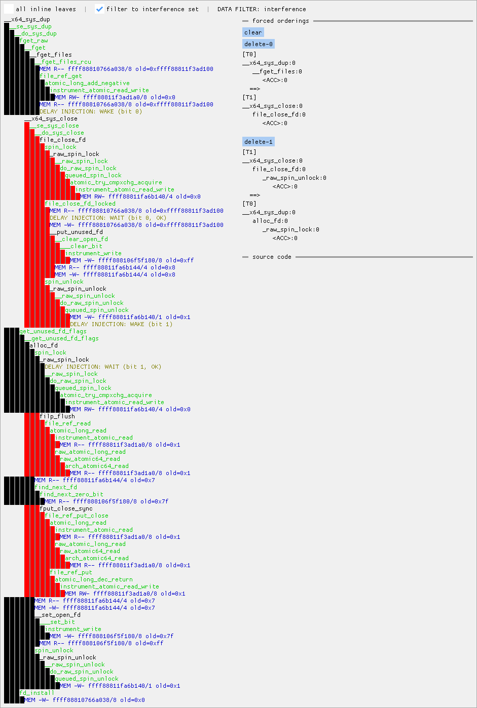

## Overview
This is tooling for exploring Linux kernel race conditions and for general
kernel debugging.

There are currently three tools:

1. A GUI for viewing KCOV traces of Linux kernel execution and memory
   accesses, with a focus on concurrent execution, and for forcing specific
   execution orderings of race conditions.
2. A terminal UI that does the same, but with less features.
3. A tool for automatically testing possible A-B-A orderings of a given
   testcase.

This is not an officially supported Google product. This project is not
eligible for the [Google Open Source Software Vulnerability Rewards
Program](https://bughunters.google.com/open-source-security).

## Build instructions: kernel
First, obtain a version of LLVM that includes commit dc5c6d008f48; meaning
either a build from HEAD, rather than from a release branch, or a build at version >=23.
Such builds are, for example, available from https://apt.llvm.org/ .
If you are a googler, see http://go/maccconc-kernel-build-notes .

Obtain a kernel tree with the required patches from TODO.

When configuring and building the kernel, set make variables
`CC` / `LLVM` / `LLVM_PREFIX` as documented at
<https://docs.kernel.org/kbuild/llvm.html> to ensure that the right LLVM
toolchain is used.

Set this environment variable to get clearer information about executed basic
blocks (for the GUI) and avoid confusing call stacks due to tail call
optimization:
`export KCFLAGS="-fno-optimize-sibling-calls -mllvm -sanitizer-coverage-prune-blocks=false"`

Configure the kernel as usual; it might be useful to start from
`make [...] kvm_guest.config` if you're not starting from an existing config.
Ensure that the following kernel config flags are set (for example through the
ncurses configuration UI `make [...] nconfig` or by pasting them at the bottom
of `.config`):
```
# for core functionality
CONFIG_SMP=y
CONFIG_NR_CPUS=4
CONFIG_KASAN=y
CONFIG_KASAN_OUTLINE=y
CONFIG_KCOV=y
CONFIG_KCOV_EXT_RECORDS=y
CONFIG_KCOV_MEMORY=y
CONFIG_KALLSYMS_ALL=y

# to give the GUI information about source lines and inlining
CONFIG_DEBUG_INFO_DWARF5=y

# for communicating with the GUI
CONFIG_VSOCKETS=y
CONFIG_VIRTIO_VSOCKETS=y
CONFIG_VIRTIO_PCI=y

# for maximizing the potential for race conditions
CONFIG_PREEMPT=y

# for making virtual addresses at runtime the same as in vmlinux
CONFIG_RANDOMIZE_BASE=n

# needed for several samples
CONFIG_TMPFS=y
```

You can also enable the following if you want to test race conditions involving
RCU, but note that this will cause a large slowdown and currently only works
properly if you the GUI.
```
CONFIG_RCU_EXPERT=y
CONFIG_RCU_STRICT_GRACE_PERIOD=y
```

Please ensure that any kernel features you want to test are compiled into the kernel, not as modules.

## Build instructions: userspace tooling
It is recommended to build the userspace tooling on the host machine; especially the GUI, which is designed to run on the host, not in the guest.

Install git and build dependencies; for Debian:
`sudo apt install git build-essential pkg-config libcapstone-dev libdw-dev libglfw3-dev`

After cloning this repository, download submodules with:
`git submodule update --init --recursive`

Build with `make`.

## Booting the built kernel
You can boot the built kernel in a normal QEMU VM if you enable the required
kernel config flags and use a disk image with a Linux distribution, or something
like that; but the recommended approach is to instead install kvmtool like this:

```
git clone https://git.kernel.org/pub/scm/linux/kernel/git/will/kvmtool.git
cd kvmtool
make
make install
```

Then you can boot the built kernel as follows (assuming $HOME/bin is in
your $PATH):
```
lkvm run --kernel [path to kernel tree]/arch/x86/boot/bzImage --vsock 5 --console virtio
```

This will give you a shell in an environment where a read-only view of the host filesystem is mounted at /host, with a minimal rootfs that mostly consists of symlinks into this host filesystem for /bin, /lib, /usr and so on. Both / and /host are 9p filesystems.

Please manually mount debugfs and tmpfs in the guest after each boot:
```
sh-5.3# mount -t debugfs none /sys/kernel/debug
sh-5.3# mount -t tmpfs none /tmp
sh-5.3#
```

## Writing and building test cases
Test cases are C code that defines four functions:
```
void test_setup(void) { [...] }
void test_thread1(void) { [...] }
void test_thread2(void) { [...] }
void test_end(void) { [...] }
```
For every execution of the test case, test_setup() will run first; then
test_thread1() and test_thread2() will run in parallel; and finally, test_end()
will run.

Test cases should be built as shared libraries, like so:
```
$ cc -shared -o [name].so [name].c -fPIC
```
The sample test cases in the testcase/ folder can also be built via make, like:
```
$ make testcase/demo-dup-vs-close.so
cc -shared -o testcase/demo-dup-vs-close.so testcase/demo-dup-vs-close.c -Wall
```

## Automatically testing A-B-A orderings
The `kcov-autorace` tool can automatically explore A-B-A execution ordering
orderings. A-B-A orderings are ones where thread A runs up to a point, then
thread B executes fully, and then thread A finishes execution.

After building a test case on the host, you can run it in the guest using the
`kcov-autorace` helper. For example:
```
sh-5.3# cd /host/{path to checkout on the host}
sh-5.3# ./kcov-autorace testcase/demo-dup-vs-close.so
loading kallsyms
RCU state (excluded): base=ffffffff82770100 len=500
loading testcase
initializing kcov
collecting A-B coverage
dup(5) = 6 (success)
testing candidates
dup(5) = -1 (Bad file descriptor)
dup(5) = -1 (Bad file descriptor)
dup(5) = -1 (Bad file descriptor)
dup(5) = 5 (success)
dup(5) = 6 (success)
dup(5) = 6 (success)
dup(5) = 6 (success)
dup(5) = 6 (success)
dup(5) = 6 (success)
dup(5) = 6 (success)
dup(5) = 6 (success)
stats:  injection-failed:0  wait-timeout:7  reordered:4
sh-5.3#
```
This shows that there is an A-B-A ordering of close(5) and dup(5) which results
in dup(5) returning 5.

Note that `kcov-autorace` and the other tools use a hardcoded spin-wait timeout
`SPIN_LIMIT`.

## Exploring race conditions in the terminal
The `kcov-terminal` tool can be used to run a testcase with manually-specified
ordering constraints. These do not specify a full ordering; instead, they
are a set of "A should happen before B" rules.

This tool is used in the guest, similarly to `kcov-autorace`.

Example usage with testcase `demo-inode-attr-change` for running with ordering
constraints that demonstrate that the reading of UID and GID by fstat() is not
atomic wrt fchown():
```
sh-5.3# ./kcov-terminal testcase/demo-inode-attr-change.so
uid=0 gid=0
=====  filtered to interference set, no RCU core  =====
LEGEND:
  type: R=read  W=write  M=modify(read+write)  F=free  A=atomic

ID    range data address      size type thread 1       thread 2
----- ----- ------------     ----- ---- --------       --------
                                                       __x64_sys_newfstat[0]
                                                         __se_sys_newfstat[0]
                                                           fdget_raw[0]
                                                             __fget_files[0]
                                                               _raw_spin_lock_irqsave[0]
B0000 R0004 ffffffff85474300     4  MA                           _raw_spin_lock_irqsave+0x44/0xe0
                                                               _raw_spin_unlock_irqrestore[0]
B0001 R0004 ffffffff85474300     1  W                            _raw_spin_unlock_irqrestore+0x1a/0x70
                                                           vfs_getattr_nosec[0]
                                                             shmem_getattr[0]
                                                               generic_fillattr[0]
B0002 R0000 ffff8881051f1fd8     4  R                            generic_fillattr+0x4a/0x340
B0003 R0001 ffff8881051f1fdc     4  R                            generic_fillattr+0x8a/0x340
                                                                 fill_mg_cmtime[0]
B0004 R0002 ffff8881051f2028     8  R                              fill_mg_cmtime+0x72/0x2a0
B0005 R0003 ffff8881051f2038     4  RA                             fill_mg_cmtime+0x9d/0x2a0
B0006 R0003 ffff8881051f2038     4  R                              fill_mg_cmtime+0xb5/0x2a0
                                        __x64_sys_fchown[0]
                                          ksys_fchown[0]
                                            fdget[0]
                                              __fget_files[0]
                                                _raw_spin_lock_irqsave[0]
A0000 R0004 ffffffff85474300     4  MA            _raw_spin_lock_irqsave+0x44/0xe0
                                                _raw_spin_unlock_irqrestore[0]
A0001 R0004 ffffffff85474300     1  W             _raw_spin_unlock_irqrestore+0x1a/0x70
                                            chown_common[0]
                                              notify_change[0]
                                                shmem_setattr[0]
                                                  setattr_copy[0]
A0002 R0000 ffff8881051f1fd8     4  W               setattr_copy+0x84/0x430
A0003 R0001 ffff8881051f1fdc     4  W               setattr_copy+0xee/0x430
                                                    inode_set_ctime_current[0]
A0004 R0003 ffff8881051f2038     4  MA                inode_set_ctime_current+0x3b1/0x680
A0005 R0002 ffff8881051f2028     8  W                 inode_set_ctime_current+0x436/0x680
enter command R or C ([R]un / [C]onstraint)> C
Enter the IDs of two accesses for which an ordering constraint should be applied.
The IDs are shown in the leftmost column (format 'A<number>' or 'B<number>').
ID of access that should happen first> B0002
ID of access that should happen afterwards> A0002
ok
enter command R or C ([R]un / [C]onstraint)> C
Enter the IDs of two accesses for which an ordering constraint should be applied.
The IDs are shown in the leftmost column (format 'A<number>' or 'B<number>').
ID of access that should happen first> A0003
ID of access that should happen afterwards> B0003
ok
enter command R or C ([R]un / [C]onstraint)> R
uid=0 gid=1
=====  filtered to interference set, no RCU core  =====
LEGEND:
  type: R=read  W=write  M=modify(read+write)  F=free  A=atomic

ID    range data address      size type thread 1       thread 2
----- ----- ------------     ----- ---- --------       --------
                                                       __x64_sys_newfstat[0]
                                                         __se_sys_newfstat[0]
                                                           fdget_raw[0]
                                                             __fget_files[0]
                                                               _raw_spin_lock_irqsave[0]
B0000 R0004 ffffffff85474300     4  MA                           _raw_spin_lock_irqsave+0x44/0xe0
                                                               _raw_spin_unlock_irqrestore[0]
B0001 R0004 ffffffff85474300     1  W                            _raw_spin_unlock_irqrestore+0x1a/0x70
                                                           vfs_getattr_nosec[0]
                                                             shmem_getattr[0]
                                                               generic_fillattr[0]
B0002 R0000 ffff8881037c62f8     4  R                            generic_fillattr+0x4a/0x340
                                                                 ***WAKE***
                                        __x64_sys_fchown[0]
                                          ksys_fchown[0]
                                            fdget[0]
                                              __fget_files[0]
                                                _raw_spin_lock_irqsave[0]
A0000 R0004 ffffffff85474300     4  MA            _raw_spin_lock_irqsave+0x44/0xe0
                                                _raw_spin_unlock_irqrestore[0]
A0001 R0004 ffffffff85474300     1  W             _raw_spin_unlock_irqrestore+0x1a/0x70
                                            chown_common[0]
                                              notify_change[0]
                                                shmem_setattr[0]
                                                  setattr_copy[0]
                                                    ***WAIT SUCCESS***
A0002 R0000 ffff8881037c62f8     4  W               setattr_copy+0x84/0x430
A0003 R0001 ffff8881037c62fc     4  W               setattr_copy+0xee/0x430
                                                    ***WAKE***
                                                                 ***WAIT SUCCESS***
B0003 R0001 ffff8881037c62fc     4  R                            generic_fillattr+0x8a/0x340
                                                    inode_set_ctime_current[0]
                                                                 fill_mg_cmtime[0]
B0004 R0002 ffff8881037c6348     8  R                              fill_mg_cmtime+0x72/0x2a0
B0005 R0003 ffff8881037c6358     4  RA                             fill_mg_cmtime+0x9d/0x2a0
B0006 R0003 ffff8881037c6358     4  R                              fill_mg_cmtime+0xb5/0x2a0
A0004 R0003 ffff8881037c6358     4  MA                inode_set_ctime_current+0x3b1/0x680
A0005 R0002 ffff8881037c6348     8  W                 inode_set_ctime_current+0x436/0x680
enter command R or C ([R]un / [C]onstraint)>
```

The line `uid=0 gid=1` shows that the desired ordering was reached.

## Exploring race conditions with a GUI
The more featureful GUI environment consists of two parts:
`kcov-gui` runs on the host and displays a GUI, while `kcov-vsock-client` runs
in the guest.

Begin by launching `./kcov-gui <path to vmlinux>` in the host, then (similar
to the previous tools) run `./kcov-vsock-client <path to testcase>` in the guest.
`kcov-vsock-client` must be re-run for every testcase execution.

Usage of the GUI is documented inside the GUI, in particular in the help tooltip
that shows up once the testcase has run once.


